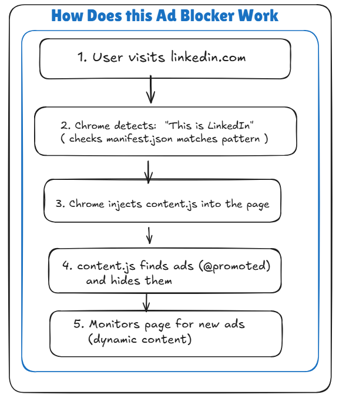

# LinkedIn CleanUp (@promoted content blocked)

A lightweight Chrome extension that automatically removes promoted posts from your LinkedIn feed, giving you a cleaner, ad-free browsing experience.

## 🎯 Features

- **Automatic Ad Removal**: Detects and removes promoted posts in real-time
- **Smart Detection**: Uses multiple methods to identify ads reliably
- **Smooth Animations**: Ads fade out gracefully instead of jarring removal
- **Dynamic Monitoring**: Continuously watches for new ads as you scroll
- **SPA Support**: Works seamlessly with LinkedIn's single-page application navigation
- **Zero Configuration**: Works immediately after installation

## 📋 Table of Contents

- [Installation](#installation)
- [How It Works](#how-it-works)
- [Technical Details](#technical-details)
- [Development](#development)
- [Troubleshooting](#troubleshooting)
- [Contributing](#contributing)
- [License](#license)

## 🚀 Installation

### From Source

1. **Clone the repository**
   ```bash
   git clone https://github.com/kranthii-k/linkedin-cleanup.git
   cd linkedin-cleanup
   ```

2. **Prepare the extension files**
   
   Ensure your directory structure looks like this:
   ```
   linkedin-cleanup/
   ├── manifest.json
   ├── content.js
   └── icons/
       ├── icon16.png
       ├── icon48.png
       └── icon128.png
   ```

3. **Create icon files** (if not already present)
   
   You'll need three icon sizes. You can create simple icons or use any image editor:
   - `icon16.png` - 16x16 pixels
   - `icon48.png` - 48x48 pixels
   - `icon128.png` - 128x128 pixels

4. **Load the extension in Chrome**
   - Open Chrome and navigate to `chrome://extensions/`
   - Enable "Developer mode" (toggle in top-right corner)
   - Click "Load unpacked"
   - Select the `linkedin-cleanup` folder
   - The extension should now appear in your extensions list

5. **Start browsing**
   - Navigate to [LinkedIn](https://www.linkedin.com)
   - Promoted posts will be automatically removed from your feed

## 🔍 How It Works

### Architecture Diagram



### Detection Methods

The extension uses a multi-layered approach to detect promoted content:

1. **Primary Method**: Targets LinkedIn's specific HTML structure
   - Looks for elements with class `.update-components-actor__sub-description`
   - Checks if the text content includes "Promoted"
   - Walks up the DOM tree to find the main post container

2. **Backup Method**: Broader text-based search
   - If the primary method finds nothing, scans all `<span>` elements
   - Identifies exact text matches for "Promoted"
   - Removes the containing post

### Removal Process

When a promoted post is detected:

1. **Smooth Animation**: Post fades out over 0.5 seconds
2. **Height Collapse**: Container height animates to 0
3. **Complete Removal**: Element is hidden with `display: none`
4. **Marking**: Container is marked with `linkedin-ad-blocked` class to prevent re-processing

### Continuous Monitoring

The extension uses several strategies to catch all ads:

- **Initial Scans**: Runs at 500ms, 1500ms, and 3000ms after page load
- **Mutation Observer**: Watches for DOM changes and triggers ad removal
- **Periodic Scanning**: Checks every 3 seconds for any missed ads
- **URL Change Detection**: Re-scans when you navigate to different LinkedIn pages

## 🛠️ Technical Details

### Manifest V3

The extension uses Manifest V3 (the latest Chrome extension standard):

```json
{
  "manifest_version": 3,
  "name": "LinkedIn Ad Blocker",
  "version": "1.0.0",
  "description": "Automatically removes promoted content from LinkedIn feeds",
  "content_scripts": [
    {
      "matches": ["https://www.linkedin.com/*"],
      "js": ["content.js"],
      "run_at": "document_idle"
    }
  ],
  "permissions": []
}
```

**Key Points**:
- `matches`: Only runs on LinkedIn URLs
- `run_at: document_idle`: Loads after the DOM is ready but before images/other resources
- `permissions: []`: Requires no special permissions (privacy-friendly!)

### Content Script Architecture

The `content.js` file is organized into four main parts:

#### Part 1: Ad Detection & Removal
```javascript
function removeAds() { ... }
```
- Main function that scans and removes ads
- Implements both primary and backup detection methods
- Returns count of ads removed

#### Part 2: Dynamic Content Monitoring
```javascript
function startObserver() { ... }
```
- Sets up MutationObserver to watch for DOM changes
- Uses debouncing (500ms delay) to avoid excessive scanning
- Monitors the main feed container or falls back to `<body>`

#### Part 3: Initialization
```javascript
function init() { ... }
```
- Orchestrates initial scans at strategic intervals
- Starts the mutation observer
- Handles both loading and loaded page states

#### Part 4: Execution
- Runs initialization
- Sets up periodic scanning
- Detects SPA navigation
- Exposes debug function (`window.removeLinkedInAds()`)

### DOM Structure Targeted

LinkedIn's promoted posts typically have this structure:

```html
<div class="feed-shared-update-v2">
  <div class="feed-shared-actor">
    <span class="update-components-actor__sub-description">
      <span>Promoted</span>
    </span>
  </div>
  <!-- Post content -->
</div>
```

The extension:
1. Finds the `Promoted` text
2. Walks up to the `feed-shared-update-v2` container
3. Removes the entire post

## 🐛 Troubleshooting

### Ads Not Being Removed

1. **Check Console Logs**
   - Open Developer Tools (F12)
   - Go to Console tab
   - Look for `[Ad Blocker]` messages
   - You should see logs like:
     ```
     [Ad Blocker] 🚀 Initializing...
     [Ad Blocker] Scanning for ads...
     [Ad Blocker] ✅ Blocked promoted post
     ```

2. **Manually Trigger Removal**
   - Open Console (F12)
   - Type: `removeLinkedInAds()`
   - Press Enter
   - Check if ads are removed

3. **Verify Extension Is Active**
   - Go to `chrome://extensions/`
   - Ensure "LinkedIn Ad Blocker" is enabled
   - Check that the toggle is ON

### LinkedIn Changed Their HTML Structure

LinkedIn occasionally updates their HTML. If ads stop being removed:

1. **Report an Issue**
   - Go to [GitHub Issues](https://github.com/kranthii-k/linkedin-cleanup/issues)
   - Create a new issue with:
     - Your Chrome version
     - Screenshot of a promoted post
     - Console logs (F12 → Console)

2. **Temporary Fix**
   - The backup method may still work
   - Check console to see which method is running

## 🔧 Development

### Debugging

Enable verbose logging in the console:

```javascript
// The extension already logs extensively
// Look for messages prefixed with [Ad Blocker]
```

### Testing Changes

1. Make changes to `content.js`
2. Go to `chrome://extensions/`
3. Click the refresh icon on the LinkedIn Ad Blocker card
4. Reload LinkedIn to test changes

### Adding New Detection Methods

To add a new way to detect ads:

```javascript
// In the removeAds() function, add after METHOD 2:

// METHOD 3: Your new detection method
const newElements = document.querySelectorAll('your-selector');
newElements.forEach((element) => {
  // Your detection logic
  if (isPromoted(element)) {
    const container = element.closest('.feed-shared-update-v2');
    if (container && !container.classList.contains('linkedin-ad-blocked')) {
      container.style.display = 'none';
      container.classList.add('linkedin-ad-blocked');
      adsRemoved++;
    }
  }
});
```

## 📊 Performance

- **Minimal CPU Usage**: Uses debouncing to limit scan frequency
- **No Network Requests**: Everything runs locally in the browser
- **Small Footprint**: ~5KB total size
- **No Background Scripts**: Only runs on LinkedIn pages

## 🔒 Privacy

This extension:
- ✅ Does NOT collect any data
- ✅ Does NOT make network requests
- ✅ Does NOT access your LinkedIn credentials
- ✅ Does NOT track your browsing
- ✅ Requires ZERO permissions
- ✅ Only runs on LinkedIn.com

All processing happens locally in your browser.

## 🤝 Contributing

Contributions are welcome! Here's how you can help:

1. **Report Bugs**
   - Open an issue describing the problem
   - Include console logs and screenshots

2. **Suggest Features**
   - Open an issue with your idea
   - Explain the use case

3. **Submit Pull Requests**
   - Fork the repository
   - Create a feature branch (`git checkout -b feature/AmazingFeature`)
   - Commit your changes (`git commit -m 'Add some AmazingFeature'`)
   - Push to the branch (`git push origin feature/AmazingFeature`)
   - Open a Pull Request

## 📝 License

This project is open source and available under the [MIT License](LICENSE).

## ⚠️ Disclaimer

This extension is not affiliated with, endorsed by, or connected to LinkedIn Corporation. It is an independent tool created to enhance user experience.

LinkedIn may change their website structure at any time, which could break the extension's functionality. We'll do our best to keep it updated.

## 📧 Contact

- **Issues**: [GitHub Issues](https://github.com/kranthii-k/linkedin-cleanup/issues)
- **Repository**: [github.com/kranthii-k/linkedin-cleanup](https://github.com/kranthii-k/linkedin-cleanup)

## 🙏 Acknowledgments

- Thanks to all contributors who help maintain and improve this extension
- Inspired by the need for a cleaner LinkedIn browsing experience

---

**Made with ❤️ for a better LinkedIn experience**

If you find this extension helpful, please star ⭐ the repository!